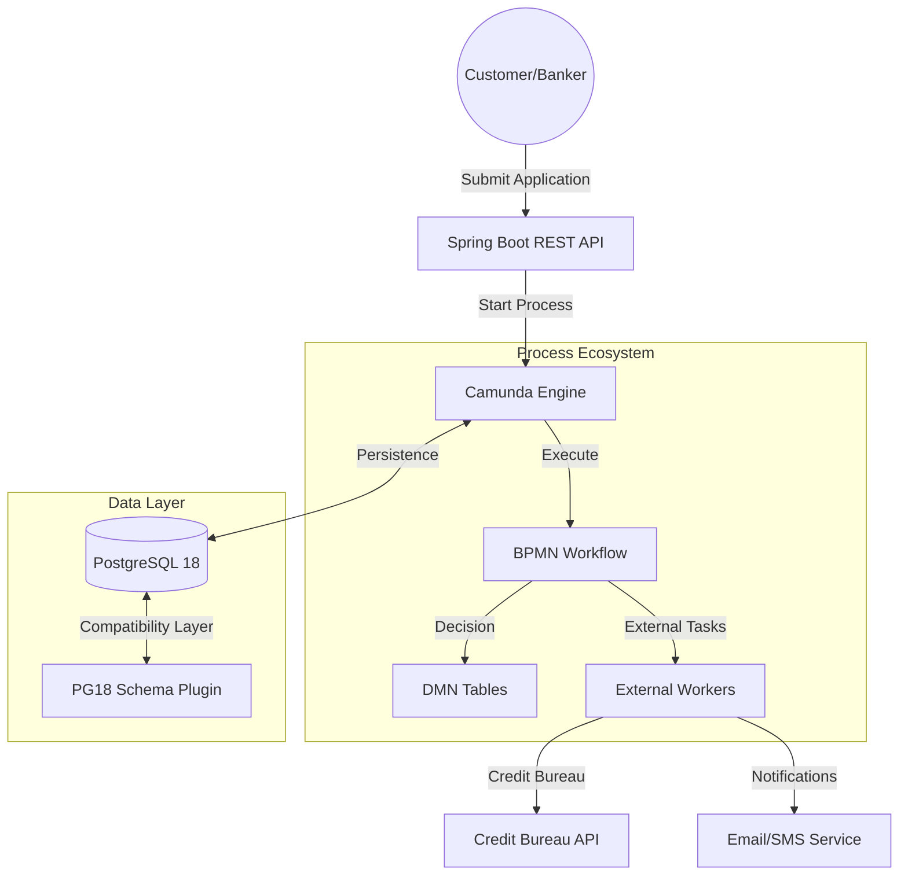
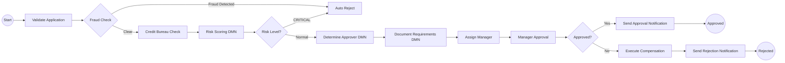
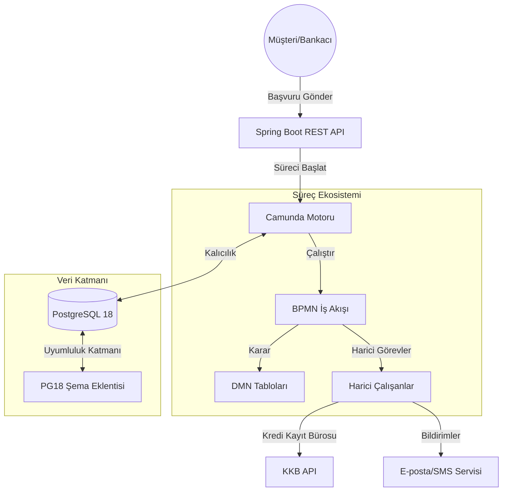
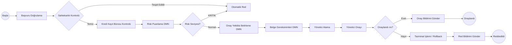

# 🚀 Camunda Credit Approval System (Enterprise Edition)

[English](#english) | [Türkçe](#türkçe)

---

<a name="english"></a>
## 🇺🇸 English Version

[](https://spring.io/projects/spring-boot)
[](https://camunda.com/)
[](https://www.postgresql.org/)
[](LICENSE)

An enterprise-grade, automated credit approval engine built with **Camunda BPM 7**, **Spring Boot 3**, and **PostgreSQL 18**. This system features advanced workflow automation, complex decision logic (DMN), and a unique compatibility layer for the latest PostgreSQL engines.

### 🏛️ System Architecture

The system follows a modern microservices-ready architecture with a clear separation between the process engine, business logic, and external task workers.



### 📋 Business Workflow (BPMN)

The core business logic is encapsulated in a high-fidelity BPMN 2.0 process. It handles everything from fraud detection to dynamic manager assignments.



### 🧠 Decision Wisdom (DMN)

We utilize **Decision Model and Notation (DMN)** to keep business rules decoupled from the code.

#### 1. Risk Scoring Engine
| Risk Category | Action | Score Range |
| :--- | :--- | :--- |
| **LOW** | APPROVE | 0 - 30 |
| **MEDIUM** | REVIEW | 31 - 65 |
| **HIGH** | REVIEW | 66 - 85 |
| **CRITICAL** | REJECT | 86 - 100 |

#### 2. Approval Authority
Dynamic assignment based on loan amount:
- **Manager:** < $100,000
- **Senior Manager:** $100k - $500k
- **Director:** > $500,000

### ⚡ Technical Innovation: PostgreSQL 18 Compatibility

This project solves a critical industry challenge: **Running Camunda 7.21 on PostgreSQL 18**. 

#### The Solution: `PostgreSQL18SchemaPlugin`
We developed a sophisticated `ProcessEnginePlugin` that:
- **Direct SQL Detection:** Uses robust information_schema queries instead of the broken JDBC metadata API.
- **Pipeline Interception:** Dynamically replaces the `CommandExecutorSchemaOperations` with a `NoOp` executor when tables are detected.
- **Driver Optimization:** Upgrades the JDBC driver to `42.7.10`.

### 🛠️ Installation & Setup

```bash
# Set your environment variables
export DB_USERNAME=your_username
export DB_PASSWORD=your_password
export CAMUNDA_ADMIN_PASSWORD=secure_admin_pass

# Build and Run
mvn clean install
mvn spring-boot:run
```

---

<a name="türkçe"></a>
## 🇹🇷 Türkçe Versiyon

**Camunda BPM 7**, **Spring Boot 3** ve **PostgreSQL 18** ile geliştirilmiş kurumsal düzeyde, otomatik bir kredi onay motoru. Bu sistem, gelişmiş iş akışı otomasyonu, karmaşık karar mantığı (DMN) ve en yeni PostgreSQL sürümleri için özel bir uyumluluk katmanı içerir.

### 🏛️ Sistem Mimarisi

Sistem; süreç motoru, iş mantığı ve harici görev çalışanları (external workers) arasında net bir ayrım yapan, modern ve mikro hizmete hazır bir mimariyi takip eder.



### 📋 İş Akışı (BPMN)

Çekirdek iş mantığı, yüksek doğruluklu bir BPMN 2.0 süreci içinde kapsüllenmiştir. Sahtekarlık tespitinden dinamik yönetici atamalarına kadar her şeyi yönetir.



### 🧠 Karar Mantığı (DMN)

İş kurallarını koddan bağımsız tutmak için **Decision Model and Notation (DMN)** kullanıyoruz.

#### 1. Risk Puanlama Motoru
| Risk Kategorisi | Eylem | Puan Aralığı |
| :--- | :--- | :--- |
| **DÜŞÜK** | ONAYLA | 0 - 30 |
| **ORTA** | İNCELE | 31 - 65 |
| **YÜKSEK** | İNCELE | 66 - 85 |
| **KRİTİK** | REDDET | 86 - 100 |

#### 2. Onay Yetkisi
Kredi tutarına göre dinamik atama:
- **Yönetici:** < 100.000 $
- **Kıdemli Yönetici:** 100k - 500k $
- **Direktör:** > 500.000 $

### ⚡ Teknik İnovasyon: PostgreSQL 18 Uyumluluğu

Bu proje, sektördeki kritik bir sorunu çözmektedir: **Camunda 7.21'i PostgreSQL 18 üzerinde çalıştırmak**.

#### Çözüm: `PostgreSQL18SchemaPlugin`
Geliştirdiğimiz gelişmiş `ProcessEnginePlugin` şunları yapar:
- **Doğrudan SQL Tespiti:** Bozuk JDBC metadata API'si yerine güçlü information_schema sorgularını kullanır.
- **Pipeline Müdahalesi:** Tablolar tespit edildiğinde şema operasyonlarını bir `NoOp` (işlemsiz) executor ile değiştirerek çakışmaları önler.
- **Sürücü Optimizasyonu:** JDBC sürücüsünü `42.7.10` sürümüne yükseltir.

### 🛠️ Kurulum ve Çalıştırma

```bash
# Ortam değişkenlerini ayarlayın
export DB_USERNAME=kullanıcı_adınız
export DB_PASSWORD=şifreniz
export CAMUNDA_ADMIN_PASSWORD=admin_şifresi

# Derle ve Çalıştır
mvn clean install
mvn spring-boot:run
```

---

## 📜 License
Distributed under the MIT License. See `LICENSE` for more information.

---
**Developed with ❤️ for high-performance workflow automation.**
