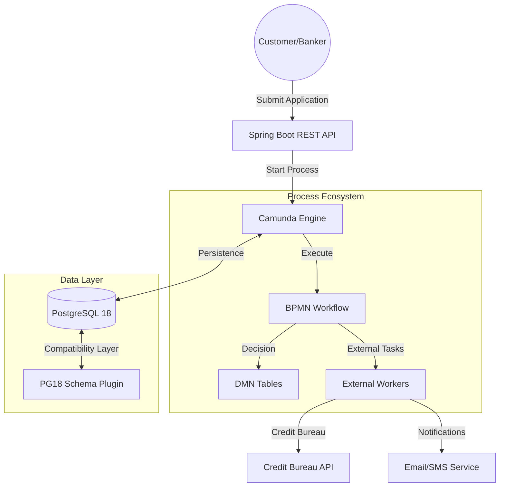
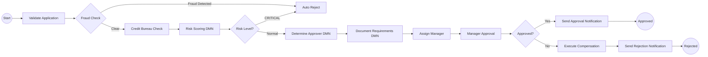

# 🚀 Camunda Credit Approval System (Enterprise Edition)

[](https://spring.io/projects/spring-boot)
[](https://camunda.com/)
[](https://www.postgresql.org/)
[](LICENSE)

An enterprise-grade, automated credit approval engine built with **Camunda BPM 7**, **Spring Boot 3**, and **PostgreSQL 18**. This system features advanced workflow automation, complex decision logic (DMN), and a unique compatibility layer for the latest PostgreSQL engines.

---

## 🏛️ System Architecture

The system follows a modern microservices-ready architecture with a clear separation between the process engine, business logic, and external task workers.



---

## 📋 Business Workflow (BPMN)

The core business logic is encapsulated in a high-fidelity BPMN 2.0 process. It handles everything from fraud detection to dynamic manager assignments.



---

## 🧠 Decision Wisdom (DMN)

We utilize **Decision Model and Notation (DMN)** to keep business rules decoupled from the code.

### 1. Risk Scoring Engine
The system evaluates applications based on:
- **Credit History (1-5)**
- **Debt to Income Ratio (%)**
- **Loan Amount**
- **Employment Status**
- **Age**

| Risk Category | Action | Score Range |
| :--- | :--- | :--- |
| **LOW** | APPROVE | 0 - 30 |
| **MEDIUM** | REVIEW | 31 - 65 |
| **HIGH** | REVIEW | 66 - 85 |
| **CRITICAL** | REJECT | 86 - 100 |

### 2. Approval Authority
Dynamic assignment based on loan amount:
- **Manager:** < $100,000
- **Senior Manager:** $100k - $500k
- **Director:** > $500,000

---

## ⚡ Technical Innovation: PostgreSQL 18 Compatibility

This project solves a critical industry challenge: **Running Camunda 7.21 on PostgreSQL 18**. 

### The Challenge
PostgreSQL 18's metadata API changes caused Camunda's schema detection to break, leading to persistent "Relation already exists" or "Tables are missing" errors.

### The Solution: `PostgreSQL18SchemaPlugin`
We developed a sophisticated `ProcessEnginePlugin` that:
- **Direct SQL Detection:** Uses robust information_schema queries instead of the broken JDBC metadata API.
- **Pipeline Interception:** Dynamically replaces the `CommandExecutorSchemaOperations` with a `NoOp` executor when tables are detected, preventing conflict.
- **Driver Optimization:** Upgrades the JDBC driver to `42.7.10` for native PG18 support.

---

## 🛠️ Installation & Setup

### Prerequisites
- Java 17+
- Maven 3.8+
- PostgreSQL 18

### 1. Configuration (Security First 🔒)
The system is configured to use environment variables for sensitive data. Never commit your passwords!

```bash
# Set your environment variables
export DB_USERNAME=your_username
export DB_PASSWORD=your_password
export CAMUNDA_ADMIN_PASSWORD=secure_admin_pass
```

### 2. Build and Run
```bash
mvn clean install
mvn spring-boot:run
```

### 3. Access URLs
- **Main Portal:** [http://localhost:8080/](http://localhost:8080/) (Login: admin / your_pass)
- **REST API Docs:** [http://localhost:8080/swagger-ui.html](http://localhost:8080/swagger-ui.html)
- **Metrics (Prometheus):** [http://localhost:8080/actuator/prometheus](http://localhost:8080/actuator/prometheus)

---

## 📸 Visual Gallery
*(Coming Soon)*
- [ ] Dashboard View
- [ ] BPMN Flow Diagram
- [ ] DMN Table Configuration
- [ ] PostgreSQL Schema View

---

## 📜 License
Distributed under the MIT License. See `LICENSE` for more information.

---
**Developed with ❤️ for high-performance workflow automation.**
