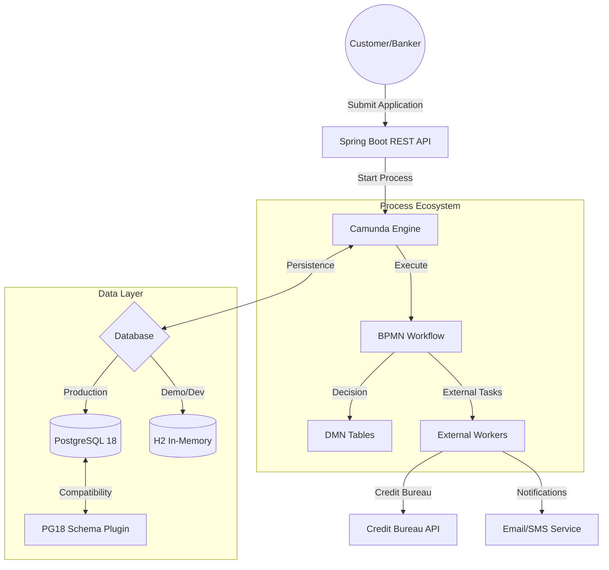
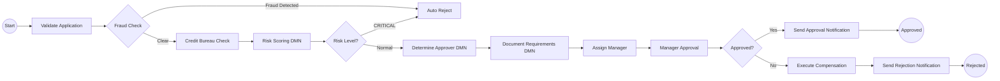
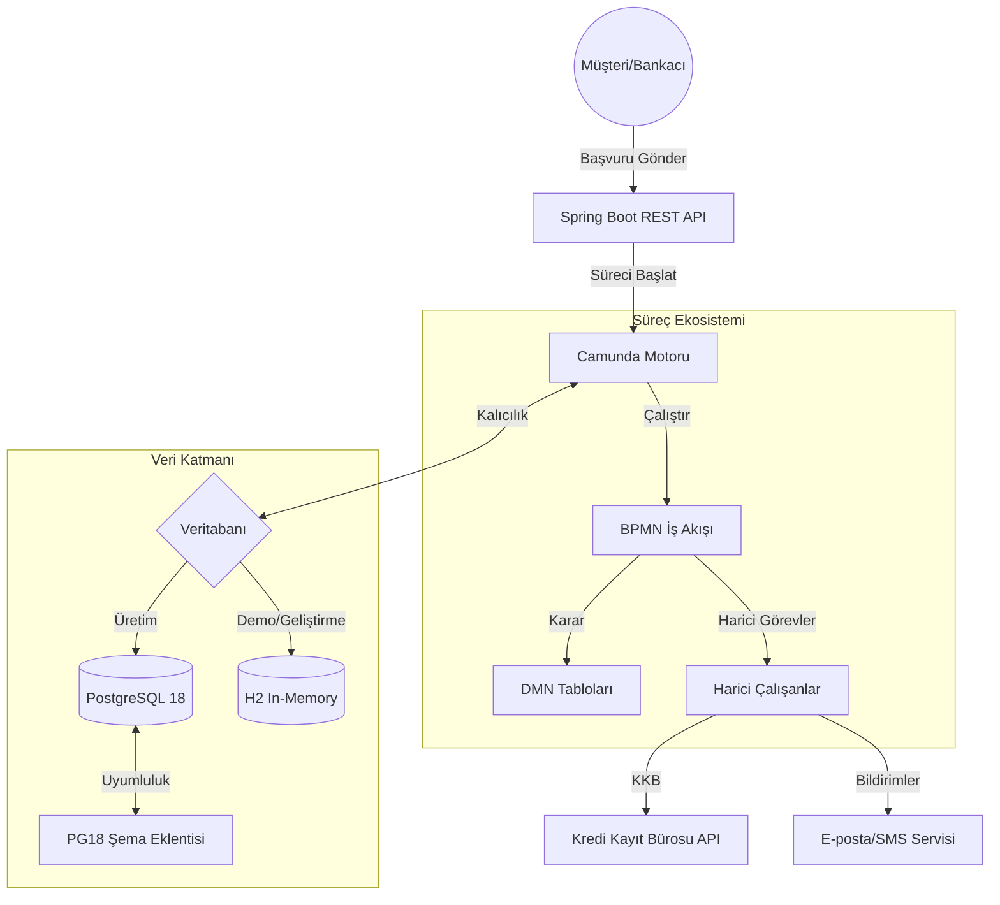
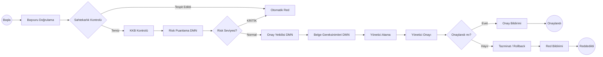

# 🚀 Camunda Credit Approval System (Enterprise Edition)

[English](#english) | [Türkçe](#türkçe)

---

<a name="english"></a>
## 🇺🇸 English Version

[](https://spring.io/projects/spring-boot)
[](https://camunda.com/)
[](https://www.postgresql.org/)
[](https://www.h2database.com/)
[](LICENSE)

An enterprise-grade, automated credit approval engine built with **Camunda BPM 7**, **Spring Boot 3**, and dual database support (**PostgreSQL 18** + **H2 In-Memory**). This system features advanced workflow automation, complex decision logic (DMN), and a unique compatibility layer for the latest PostgreSQL engines.

### 🏛️ System Architecture



### 📋 Business Workflow (BPMN)



### 🧠 Decision Logic (DMN)

#### Risk Scoring Engine
| Risk Category | Action | Score Range |
| :--- | :--- | :--- |
| **LOW** | APPROVE | 0 - 30 |
| **MEDIUM** | REVIEW | 31 - 65 |
| **HIGH** | REVIEW | 66 - 85 |
| **CRITICAL** | REJECT | 86 - 100 |

#### Approval Authority
- **Manager:** < $100,000
- **Senior Manager:** $100k - $500k
- **Director:** > $500,000

### 💾 Dual Database Support

| Feature | H2 (Default) | PostgreSQL 18 |
| :--- | :--- | :--- |
| **Profile** | `h2` | `postgres` |
| **Setup Required** | ❌ None | ✅ Database creation |
| **Use Case** | Demo, Development | Production |
| **H2 Console** | ✅ `/h2-console` | ❌ N/A |
| **Persistence** | In-Memory | Disk |
| **PG18 Plugin** | ❌ Not needed | ✅ Auto-activated |

### ⚡ PostgreSQL 18 Compatibility Fix

**Problem:** PostgreSQL 18 changed `DatabaseMetaData.getTables()` behavior, breaking Camunda 7.21's schema detection.

**Solution:** Custom `PostgreSQL18SchemaPlugin` that:
- Uses direct SQL queries instead of broken JDBC metadata API
- Dynamically replaces `CommandExecutorSchemaOperations` with a `NoOp` executor
- Only activates with `postgres` profile via `@Profile("postgres")`

### 🛠️ Quick Start

#### Option A: Zero-Config Demo (H2)
```bash
# No database setup needed!
mvn spring-boot:run
# H2 Console: http://localhost:8080/h2-console
```

#### Option B: Production (PostgreSQL 18)
```bash
export DB_USERNAME=your_username
export DB_PASSWORD=your_password
mvn spring-boot:run -Dspring.profiles.active=postgres
```

### 🔗 Access URLs
| Service | URL |
| :--- | :--- |
| **Main Portal** | http://localhost:8080/ |
| **H2 Console** | http://localhost:8080/h2-console |
| **Swagger UI** | http://localhost:8080/swagger-ui.html |
| **REST API** | http://localhost:8080/engine-rest/ |

---

<a name="türkçe"></a>
## 🇹🇷 Türkçe Versiyon

**Camunda BPM 7**, **Spring Boot 3** ve çift veritabanı desteği (**PostgreSQL 18** + **H2 In-Memory**) ile geliştirilmiş kurumsal düzeyde, otomatik bir kredi onay motoru.

### 🏛️ Sistem Mimarisi



### 📋 İş Akışı (BPMN)



### 🧠 Karar Mantığı (DMN)

#### Risk Puanlama Motoru
| Risk Kategorisi | Eylem | Puan Aralığı |
| :--- | :--- | :--- |
| **DÜŞÜK** | ONAYLA | 0 - 30 |
| **ORTA** | İNCELE | 31 - 65 |
| **YÜKSEK** | İNCELE | 66 - 85 |
| **KRİTİK** | REDDET | 86 - 100 |

#### Onay Yetkisi
- **Yönetici:** < 100.000 $
- **Kıdemli Yönetici:** 100k - 500k $
- **Direktör:** > 500.000 $

### 💾 Çift Veritabanı Desteği

| Özellik | H2 (Varsayılan) | PostgreSQL 18 |
| :--- | :--- | :--- |
| **Profil** | `h2` | `postgres` |
| **Kurulum** | ❌ Gerekmez | ✅ Veritabanı oluşturma |
| **Kullanım** | Demo, Geliştirme | Üretim |
| **H2 Konsolu** | ✅ `/h2-console` | ❌ Yok |
| **Kalıcılık** | Bellekte | Diskte |

### ⚡ PostgreSQL 18 Uyumluluk Çözümü

**Problem:** PostgreSQL 18, `DatabaseMetaData.getTables()` davranışını değiştirdi ve Camunda 7.21'in şema algılamasını bozdu.

**Çözüm:** Özel `PostgreSQL18SchemaPlugin`:
- Bozuk JDBC metadata API yerine doğrudan SQL sorguları kullanır
- `CommandExecutorSchemaOperations`'ı `NoOp` executor ile değiştirir
- `@Profile("postgres")` ile sadece PostgreSQL profilinde aktifleşir

### 🛠️ Hızlı Başlangıç

#### Seçenek A: Sıfır Konfigürasyon Demo (H2)
```bash
# Veritabanı kurulumu gerekmez!
mvn spring-boot:run
# H2 Konsolu: http://localhost:8080/h2-console
```

#### Seçenek B: Üretim (PostgreSQL 18)
```bash
export DB_USERNAME=kullanıcı_adınız
export DB_PASSWORD=şifreniz
mvn spring-boot:run -Dspring.profiles.active=postgres
```

---

## 📜 License
Distributed under the MIT License. See `LICENSE` for more information.

---
**Developed with ❤️ for high-performance workflow automation.**
